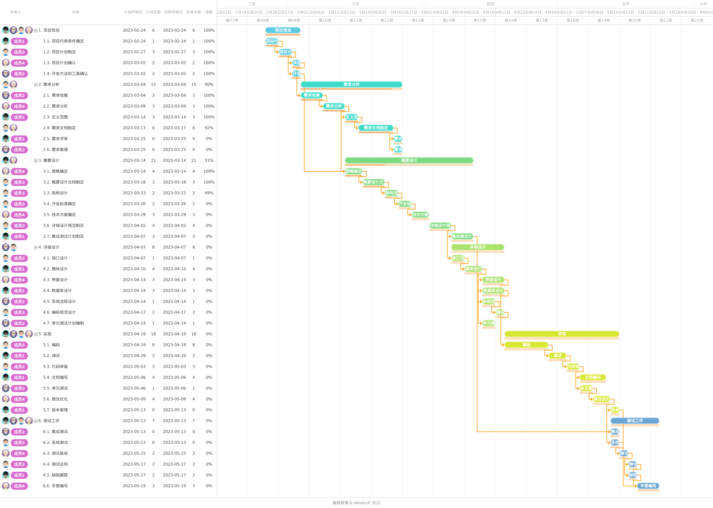

# SE-Final-Project
**SDU Software Engineering FP**

## Software Chicken个人博客网站

Software Chicken是一个用于个人展示、分享和记录个人经验、观点、技能和兴趣的在线平台。作为一个典型的个人博客网站，只有网站拥有者可以上传和管理博客，其他注册用户只有浏览和评论的权限。这样的设计可以保证博客网站的内容质量和安全性，同时也可以为用户提供一个高品质的内容平台和社区交流平台。

具体功能模块如下：

### 前台博客网站：

1. 用户模块：
   - 用户注册：用户可以通过邮箱进行账号注册，网站会向用户的邮箱发送邮箱验证码，验证成功后即注册成功。
   - 用户登录：输入正确邮箱、密码并使用滑块验证码验证为真实用户后登录成功，另外支持用户使用qq直接登录。
   - 个人信息：可在个人中心设置用户头像、昵称、个人简介、博客链接等内容。
2. 浏览模块：
   - 支持白天、黑夜浏览模式的切换。
   - 支持中文、英文的语言切换。
   - 支持搜索引擎搜索相关博客。
   - 支持快捷键返回页顶、页尾
3. 博客模块：
   - 对博客按置顶、推荐、普通三种优先级进行展示。
   - 对博客进行标签分类管理。
   - 对博客发布按时间线进行归档展示。
   - 显示博客的字数和预计阅读时间。
   - 支持用户在博客下方评论、回复。
4. 其他模块：
   - 说说：发布文字+图片形式的短篇动态。
   - 留言：支持用户在留言板给网站留言。
   - 友链：展示朋友的个人博客链接。
   - 相册：展示照片。

### 后台管理网站：

- 可视化展示网站数据，如访问量、用户量、文章贡献、文章浏览量等数据。
- 对文章的管理，包括增删改查及文章的分类、标签的增删改查。
- 对说说的管理，包括增删改查。
- 对用户评论的管理，包括增删改查
- 权限的管理，包括后台菜单的增删改查、前后端api的增删改查、和用户角色的增删改查。
- 用户管理，包括对全部用户和在线用户的信息编辑和查询。
- 相册管理，包括对相册的增删改查和照片的增删改查。
- 系统管理，包括对网站信息的编辑、定时任务的管理、友链的增删改查和网站简介的管理。
- 日志管理，包括对异常日志的增删查和操作日志的增删查。

### Project WBS:

### Project Progress Estimation:

### Event Map:

### Project Gantt Chart:

